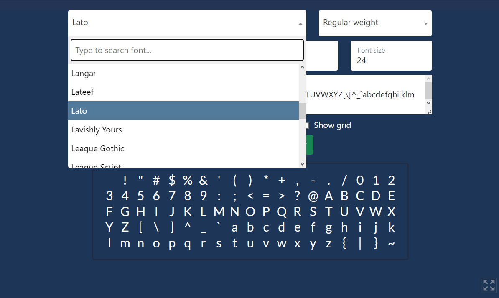
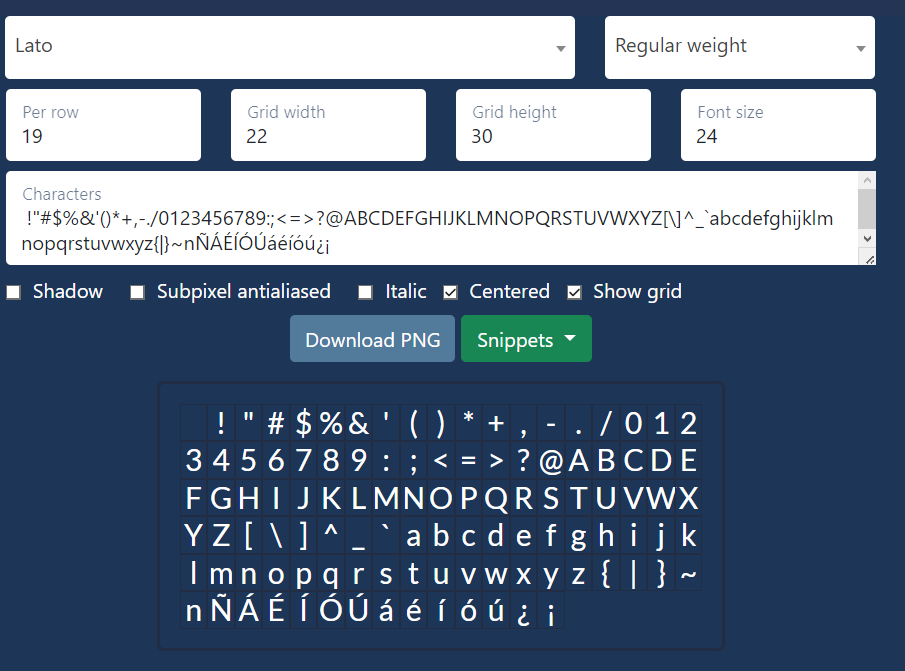
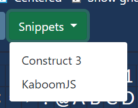
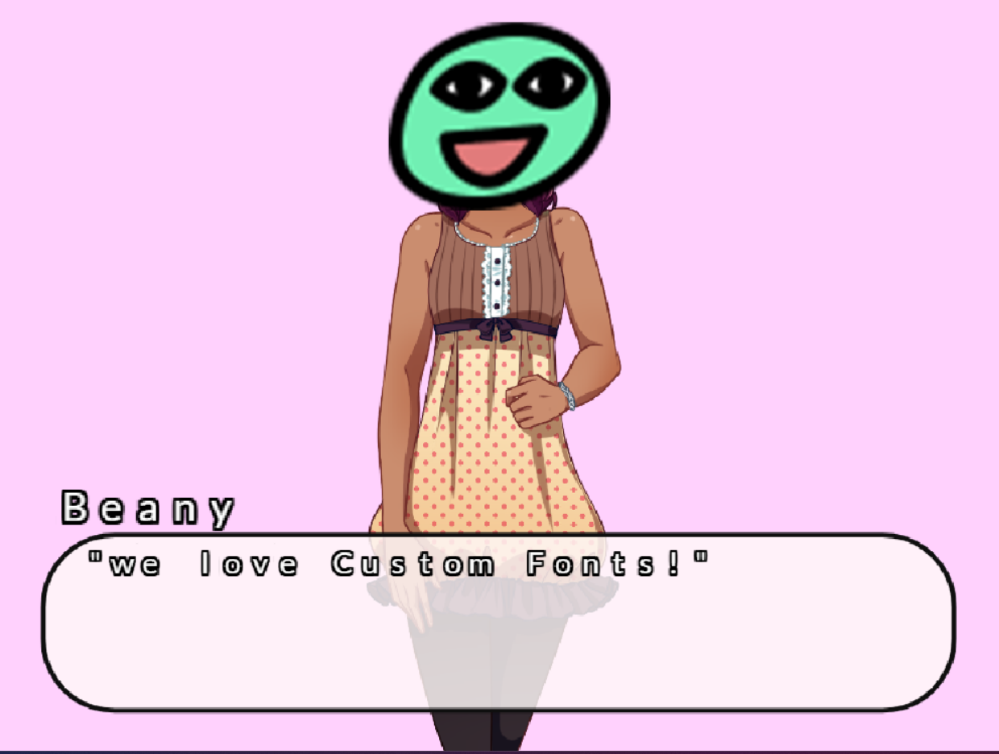

## Use custom fonts

OpenType and TrueType fonts will not be supported until Kaboom is released 
from version 2000. So here's a short tutorial on how to load your own fonts 
using [Font2BitMap](https://stmn.itch.io/font2bitmap)

First, we select a font from the list, for example, this page font, Lato


Now, we can select the characters to load with the font, for example if you need use
Spanish characters, we should load this in characters
```
!"#$%&'()*+,-./0123456789:;<=>?@ABCDEFGHIJKLMNOPQRSTUVWXYZ[\]^_`abcdefghijklmnopqrstuvwxyz{|}~nÑÁÉÍÓÚáéíóú¿¡
```

You can edit the other options like **weight**, grid **witdth** and **height** to get the best
font for your game, then **Download PNG**


Now, go to `snippets` and select `KaboomJS`


You will have copied the corresponding code, now we can go to our code and load it using Kaboom

```js
loadFont("Lato", "Lato_font2bitmap.png", 22, 30, {chars: " !\"#$%&'()*+,-./0123456789:;<=>?@ABCDEFGHIJKLMNOPQRSTUVWXYZ[\\]^_`abcdefghijklmnopqrstuvwxyz{|}~nÑÁÉÍÓÚáéíóú¿¡"});

// load in KaNovel using kanovel()
kanovel({
    textbox: {
        text: {
            font: "Lato"
        }
    }
})
```

