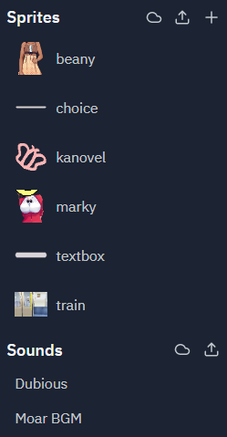
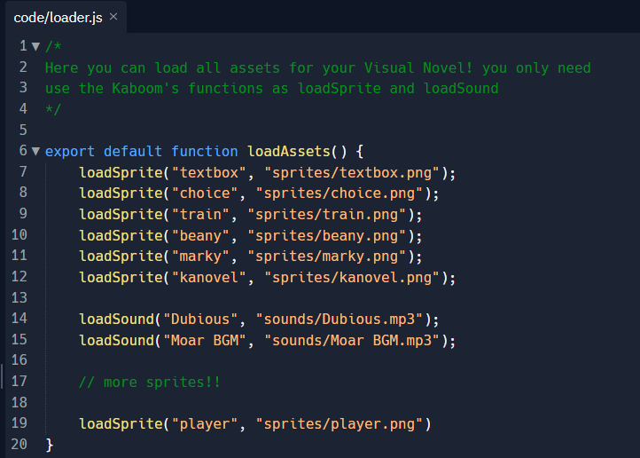
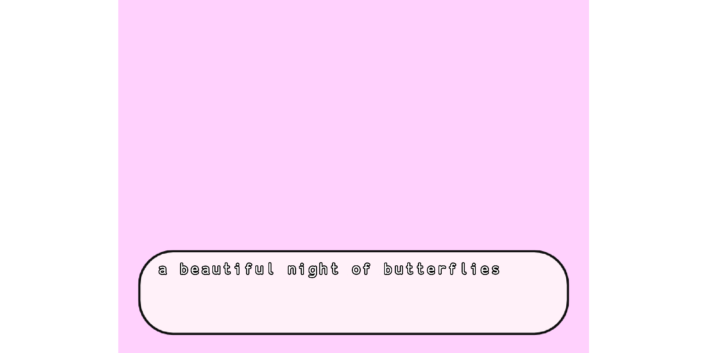
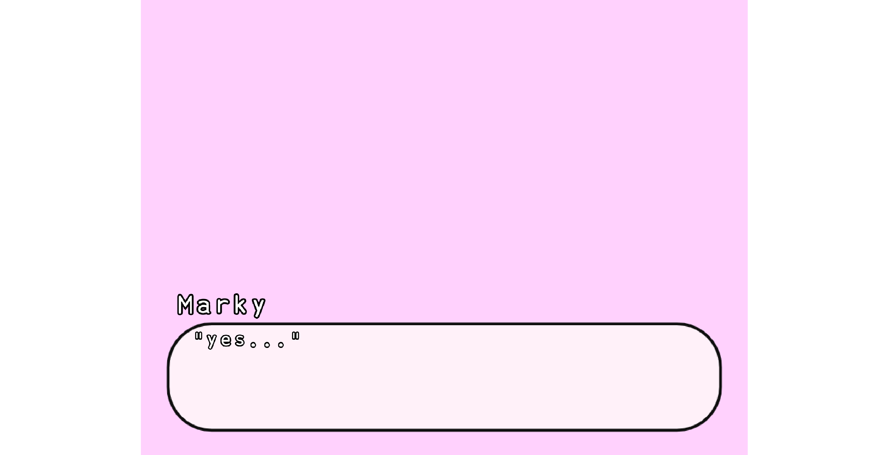

# Basics ⛳

KaNovel is too easy, but you need learn it first, don't worry, it's quite easy and fast. Here you will learn how to use KaNovel and start using the **Narration** in your novel

## Load Assets

The first rule is load assets, there will already be a couple of assets loaded in `loader`.



But the assets are not loaded by magic, they are loaded by code in the `loader` file, so feel free to edit the file to load the sprites you need.



You can use Kaboom Functions* for load assets

`loadSprite("spriteID", "spritePath")` <br>
`loadSound("soundID", "soundPath")`

\* *for the full options of these functions, check the Kaboom documentation.*

## Narration

In a visual novel, It is normal to have chapters, speaking characters in our story.

**All Kanovel's visual novels start with the chapter start**

```js
chapter("start", () => [
    // Here the history make functions
]);
```

Now, the normal thing would be to have a protagonist or a narrator, you're in luck! you don't need to define anything to start using them.

You can speak as the protagonsit with `prota()` function
```js
chapter("start", () => [
    prota("a beautiful night of butterflies"),
]);
```

Or if you want use a narrator, you can use `narrator()` (although it is relatively the same)

```js
chapter("start", () => [
    narrator("a beautiful night of butterflies"),
]);
```



What? You want use a character?

To use characters, we must first define them, for that there is `character()`, with a character id and a character display name

```js
character("m", "Marky");

chapter("start", () => [
    narrator("a beautiful night of butterflies"),
]);
```

That's it! Now we can use `char()` to make she talk

```js
character("m", "Marky");

chapter("start", () => [
    narrator("a beautiful night of butterflies"),
    char("yes..."),
]);
```



*\* to see how to edit the text box see Customization*